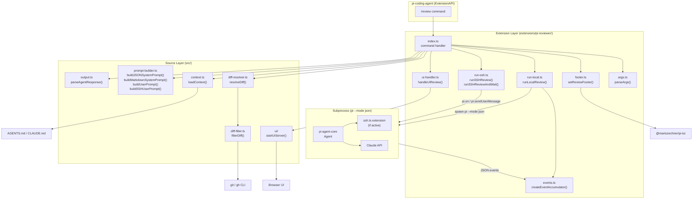
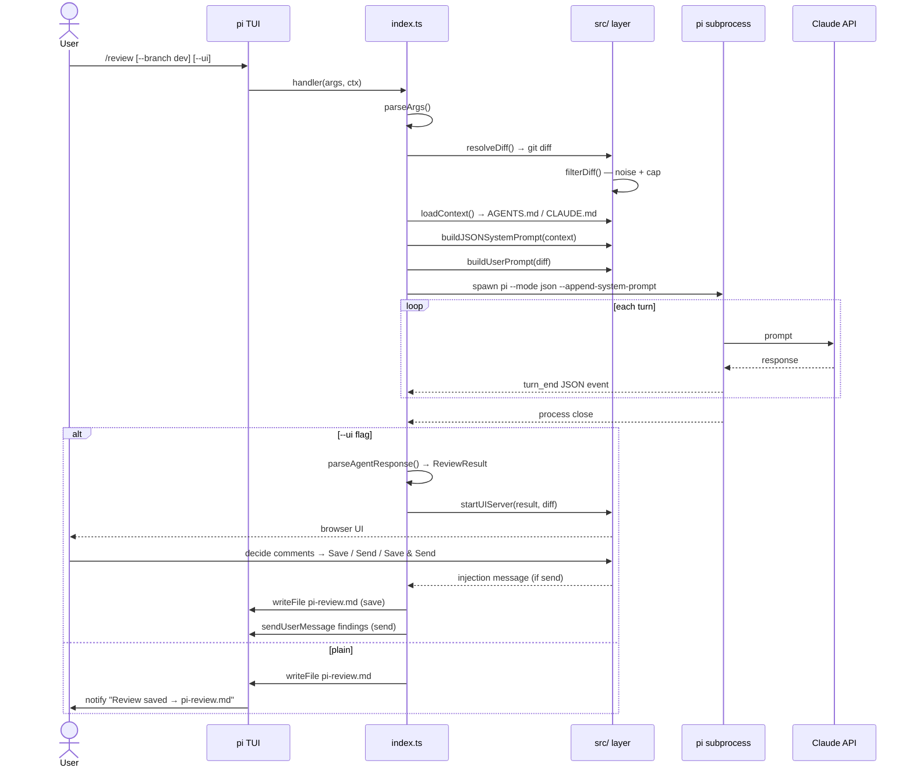
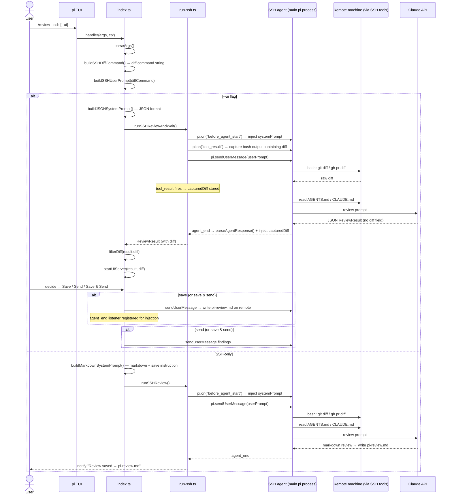

# Architecture

## Layers

## Runtime flow

### Local mode (`/review`)

### SSH mode (`/review --ssh`)

## Key design decisions

### Why the agent fetches its own diff in SSH mode

In SSH mode, the agent's bash/read/write/edit tools are transparently redirected over SSH by the `ssh.ts` extension. When we ask the agent to run `git diff ...`, it runs on the remote automatically. This means we don't need to implement SSH ourselves — we just tell the agent which command to run.

Previously the diff was fetched locally via `pi.exec`, but `pi.exec` is a plain local `spawn()` — it is **not** SSH-redirected. Only the agent's tools are. So having the agent fetch its own diff is both simpler and correct.

### Why the diff is captured from `tool_result` in SSH+UI mode

In SSH+UI mode, the UI needs the full diff for rendering. Asking the agent to echo the diff back inside its JSON response would:
1. Print the entire diff to the terminal as part of the agent's response text
2. Increase token count and slow down streaming

Instead, `run-ssh.ts` listens to the `tool_result` event and captures any bash output that contains `diff --git` — the standard git diff format. This gives us the full diff silently, without it appearing in the agent's response.

### Why `handleUIReview` returns the injection message instead of sending it

`handleUIReview` is called while the command handler is still suspended at `await handleUIReview(...)`. Calling `pi.sendUserMessage` from inside a suspended command causes an "Agent is already processing" error when:
- SSH+UI save-and-send: `saveRemote` already started the agent; the injection can't start a second concurrent turn.

The fix: `handleUIReview` returns the injection message. The caller sends it at the right time:
- **Local / SSH send-only**: agent is idle → `pi.sendUserMessage(injectionMsg)` called before the command returns.
- **SSH save-and-send**: `saveRemote` started the agent → a one-time `agent_end` listener sends the injection after the save turn completes (by which point the command has already returned).

### System prompt structure

`prompt-builder.ts` has a private `buildSharedBase(minSeverity)` that holds the role, severity tiers, rules, and severity filter — the ~90% shared between both public functions:

- **`buildJSONSystemPrompt(context, minSeverity)`** — adds the conventions-don't-repeat rule, JSON schema, and injects conventions/review-rules from context. Used by local mode and SSH+UI.
- **`buildMarkdownSystemPrompt(minSeverity)`** — adds the markdown format instructions and the save-to-pi-review.md instruction. Used by SSH-only.

User prompts:
- **`buildUserPrompt(diff, skippedFiles)`** — diff only; conventions already in system prompt (local mode).
- **`buildSSHUserPrompt(diffCommand)`** — instructs the agent to run the given diff command, then read `AGENTS.md`/`CLAUDE.md`, then review. Used by both SSH modes since the agent fetches everything at runtime.

### SSH-only vs SSH+UI divergence

Both modes share identical setup (`buildSSHDiffCommand` + `buildSSHUserPrompt`). They diverge only on:
- **System prompt format**: `buildMarkdownSystemPrompt` (markdown + save instruction) vs `buildJSONSystemPrompt` (JSON schema)
- **Agent execution**: `runSSHReview` (fire-and-forget) vs `runSSHReviewAndWait` (awaits JSON result + captures diff from `tool_result`)
- **Post-review**: SSH-only agent saves the file itself; SSH+UI returns the result to the local process for UI rendering
